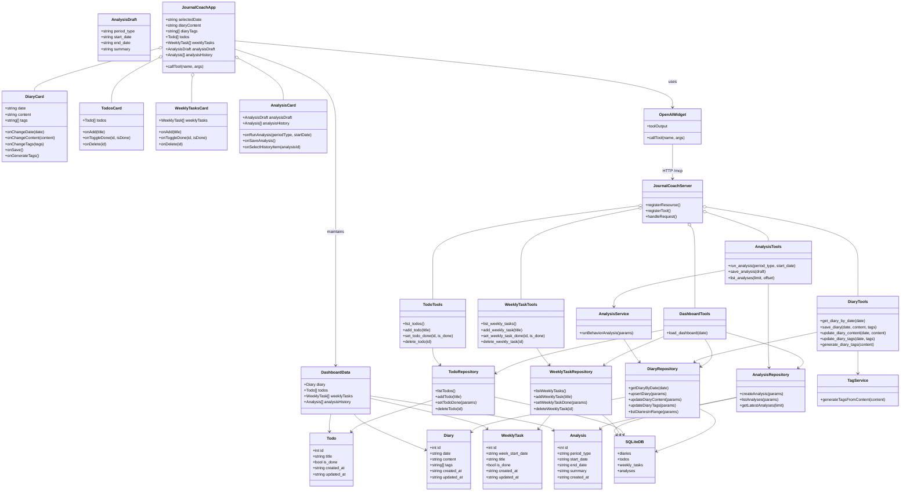

```mermaid
classDiagram
  direction TB
  %% ====== ドメイン（型定義） ======
  class Diary {
    +int id
    +string date
    +string content
    +string[] tags
    +string created_at
    +string updated_at
  }

  class Todo {
    +int id
    +string title
    +bool is_done
    +string created_at
    +string updated_at
  }

  class WeeklyTask {
    +int id
    +string week_start_date
    +string title
    +bool is_done
    +string created_at
    +string updated_at
  }

  class Analysis {
    +int id
    +string period_type
    +string start_date
    +string end_date
    +string summary
    +string created_at
  }

  class AnalysisDraft {
    +string period_type
    +string start_date
    +string end_date
    +string summary
  }

  class DashboardData {
    +Diary diary
    +Todo[] todos
    +WeeklyTask[] weeklyTasks
    +Analysis[] analysisHistory
  }

  %% ====== フロントエンド（React） ======
  class JournalCoachApp {
    +string selectedDate
    +string diaryContent
    +string[] diaryTags
    +Todo[] todos
    +WeeklyTask[] weeklyTasks
    +AnalysisDraft analysisDraft
    +Analysis[] analysisHistory
    +callTool(name, args)
  }

  class DiaryCard {
    +string date
    +string content
    +string[] tags
    +onChangeDate(date)
    +onChangeContent(content)
    +onChangeTags(tags)
    +onSave()
    +onGenerateTags()
  }

  class TodosCard {
    +Todo[] todos
    +onAdd(title)
    +onToggleDone(id, isDone)
    +onDelete(id)
  }

  class WeeklyTasksCard {
    +WeeklyTask[] weeklyTasks
    +onAdd(title)
    +onToggleDone(id, isDone)
    +onDelete(id)
  }

  class AnalysisCard {
    +AnalysisDraft analysisDraft
    +Analysis[] analysisHistory
    +onRunAnalysis(periodType, startDate)
    +onSaveAnalysis()
    +onSelectHistoryItem(analysisId)
  }

  class OpenAIWidget {
    +toolOutput
    +callTool(name, args)
  }

  %% ====== MCP サーバー（server.ts 周辺） ======
  class JournalCoachServer {
    +registerResource()
    +registerTool()
    +handleRequest()
  }

  class DashboardTools {
    +load_dashboard(date)
  }

  class DiaryTools {
    +get_diary_by_date(date)
    +save_diary(date, content, tags)
    +update_diary_content(date, content)
    +update_diary_tags(date, tags)
    +generate_diary_tags(content)
  }

  class TodoTools {
    +list_todos()
    +add_todo(title)
    +set_todo_done(id, is_done)
    +delete_todo(id)
  }

  class WeeklyTaskTools {
    +list_weekly_tasks()
    +add_weekly_task(title)
    +set_weekly_task_done(id, is_done)
    +delete_weekly_task(id)
  }

  class AnalysisTools {
    +run_analysis(period_type, start_date)
    +save_analysis(draft)
    +list_analyses(limit, offset)
  }

  %% ====== Repository レイヤー ======
  class DiaryRepository {
    +getDiaryByDate(date)
    +upsertDiary(params)
    +updateDiaryContent(params)
    +updateDiaryTags(params)
    +listDiariesInRange(params)
  }

  class TodoRepository {
    +listTodos()
    +addTodo(title)
    +setTodoDone(params)
    +deleteTodo(id)
  }

  class WeeklyTaskRepository {
    +listWeeklyTasks()
    +addWeeklyTask(title)
    +setWeeklyTaskDone(params)
    +deleteWeeklyTask(id)
  }

  class AnalysisRepository {
    +createAnalysis(params)
    +listAnalyses(params)
    +getLatestAnalyses(limit)
  }

  %% ====== Service レイヤー（GPT 連携） ======
  class TagService {
    +generateTagsFromContent(content)
  }

  class AnalysisService {
    +runBehaviorAnalysis(params)
  }

  %% ====== DB（SQLite） ======
  class SQLiteDB {
    +diaries
    +todos
    +weekly_tasks
    +analyses
  }

  %% ====== 関係 ======

  %% フロント内の関係
  JournalCoachApp o-- DiaryCard
  JournalCoachApp o-- TodosCard
  JournalCoachApp o-- WeeklyTasksCard
  JournalCoachApp o-- AnalysisCard

  JournalCoachApp --> DashboardData : maintains
  JournalCoachApp --> OpenAIWidget : uses

  %% MCP サーバーまわり
  OpenAIWidget --> JournalCoachServer : HTTP /mcp
  JournalCoachServer o-- DashboardTools
  JournalCoachServer o-- DiaryTools
  JournalCoachServer o-- TodoTools
  JournalCoachServer o-- WeeklyTaskTools
  JournalCoachServer o-- AnalysisTools

  %% Tools → Repository / Service
  DashboardTools --> DiaryRepository
  DashboardTools --> TodoRepository
  DashboardTools --> WeeklyTaskRepository
  DashboardTools --> AnalysisRepository

  DiaryTools --> DiaryRepository
  DiaryTools --> TagService

  TodoTools --> TodoRepository
  WeeklyTaskTools --> WeeklyTaskRepository

  AnalysisTools --> AnalysisRepository
  AnalysisTools --> AnalysisService
  AnalysisService --> DiaryRepository

  %% Repository → DB
  DiaryRepository --> Diary
  TodoRepository --> Todo
  WeeklyTaskRepository --> WeeklyTask
  AnalysisRepository --> Analysis

  DiaryRepository --> SQLiteDB
  TodoRepository --> SQLiteDB
  WeeklyTaskRepository --> SQLiteDB
  AnalysisRepository --> SQLiteDB

  %% DashboardData 集約
  DashboardData --> Diary
  DashboardData --> Todo
  DashboardData --> WeeklyTask
  DashboardData --> Analysis   
``` 