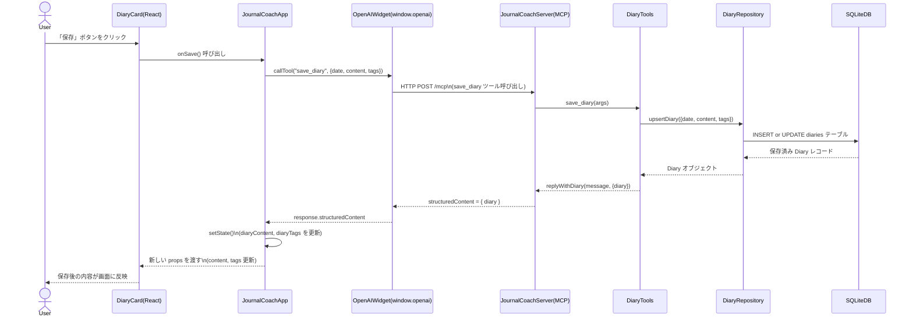

```mermaid
sequenceDiagram
    %% 参加者定義
    actor User as User
    participant DiaryCard as DiaryCard(React)
    participant App as JournalCoachApp
    participant Widget as OpenAIWidget(window.openai)
    participant Server as JournalCoachServer(MCP)
    participant DiaryTools as DiaryTools
    participant DiaryRepo as DiaryRepository
    participant DB as SQLiteDB

    %% フロント側のイベント
    User->>DiaryCard: 「保存」ボタンをクリック
    DiaryCard->>App: onSave() 呼び出し
    App->>Widget: callTool("save_diary", {date, content, tags})

    %% MCP サーバー側
    Widget->>Server: HTTP POST /mcp\n(save_diary ツール呼び出し)
    Server->>DiaryTools: save_diary(args)

    %% Repository 経由で DB 保存
    DiaryTools->>DiaryRepo: upsertDiary({date, content, tags})
    DiaryRepo->>DB: INSERT or UPDATE diaries テーブル
    DB-->>DiaryRepo: 保存済み Diary レコード
    DiaryRepo-->>DiaryTools: Diary オブジェクト

    %% ツールの戻り値（structuredContent）
    DiaryTools-->>Server: replyWithDiary(message, {diary})
    Server-->>Widget: structuredContent = { diary }

    %% フロントへ結果を返す
    Widget-->>App: response.structuredContent
    App->>App: setState()\n(diaryContent, diaryTags を更新)
    App-->>DiaryCard: 新しい props を渡す\n(content, tags 更新)
    DiaryCard-->>User: 保存後の内容が画面に反映

```