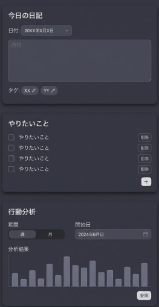

**0. 画面設計**
    週間タスクリストは、やりたいことカードのタイトルを修正するだけ
    以下、画面イメージ
    

**1. 30秒要点**
* この「詳細設計フル版」は、サーバー（MCP＋SQLite）とフロント（React＋Apps SDK UI）の両方を、ファイル構成・型・ツール一覧まで全部 1 つに整理したものです。
* Apps SDK Quickstart の Todo サンプルと同じ構造で、「日記＋やりたいこと＋週間タスク＋行動分析」のダッシュボード 1 画面を出します。([OpenAI Developers][1])
* テキスト欄はすべてユーザーが編集でき、保存ボタンで MCP ツールを呼び出し、構造化データ（structuredContent）を通じて画面を更新する前提です。([OpenAI Developers][1])

---

## 2. 手順（詳細設計フルバージョン）

### 手順1：全体アーキテクチャ

#### 1-1. 概要

* **構成要素は 3 つ**

  1. ChatGPT（Apps SDK）… ホスト側。
  2. MCP サーバー（Node.js＋TypeScript）… ツールと UI リソースを提供。([OpenAI Developers][2])
  3. SQLite DB … データ保存。

* **会話の流れ**

  * ChatGPT がユーザーとの会話から「日記を書いて」などを解釈。
  * 必要に応じて MCP ツール（`load_dashboard` など）を呼ぶ。
  * MCP ツールの結果（structuredContent）が `window.openai.toolOutput` 経由で UI に渡る。([OpenAI Developers][1])

#### 1-2. ディレクトリ構成

```text
project-root/
  server/                    # MCP サーバー側
    server.ts                # MCP サーバー本体
    db.ts                    # SQLite 接続 + schema.sql 実行
    schema.sql               # テーブル定義
    types.ts                 # Diary/Todo などの型
    repositories/            # DB アクセスまとめ
      diaryRepository.ts
      todoRepository.ts
      weeklyTaskRepository.ts
      analysisRepository.ts
    services/                # GPT 連携などビジネスロジック
      tagService.ts
      analysisService.ts
    tools/                   # MCP ツールのハンドラ集
      dashboardTools.ts
      diaryTools.ts
      todoTools.ts
      weeklyTaskTools.ts
      analysisTools.ts
      helpers.ts
  web/                       # フロント（React＋Apps SDK UI）
    index.html               # vite 等のエントリ
    src/
      main.tsx               # React エントリ
      App.tsx                # 全体レイアウト
      types.ts               # server/types.ts のフロント側向けコピー
      components/
        DiaryCard.tsx
        TodosCard.tsx
        WeeklyTasksCard.tsx
        AnalysisCard.tsx
  public/
    journal-widget.html      # ChatGPT が読み込むウィジェット HTML
```

* `journal-widget.html` は Quickstart の `todo-widget.html` と同じ役割で、ビルドされた JS を `<script>` タグで読み込む。([OpenAI Developers][1])

---

### 手順2：DB 詳細設計（schema.sql）

#### 2-1. テーブル一覧

1. `diaries` … 日記本体＋タグ
2. `todos` … 「やりたいこと」
3. `weekly_tasks` … 週間タスク
4. `analyses` … 行動分析の履歴

#### 2-2. テーブル仕様

1. **`diaries`**

* 1 日につき 1 レコード（`date` を UNIQUE）
* タグは最大 5 個（`tag1`〜`tag5`）
* 作成日時・更新日時を自動格納

2. **`todos`**

* シンプルな Todo リスト
* 優先度や締切は今回はなし（将来拡張）
* `is_done` は 0/1

3. **`weekly_tasks`**

* `week_start_date` で週を識別（その週の日曜日）

4. **`analyses`**

* 期間種別（週 / 月）＋開始日＋終了日
* `summary` に GPT が出した分析文を保存

※ 実際の DDL は後の「3. コピペ用ブロック」に全文記載します。

---

### 手順3：サーバー内部構造（repositories / services / tools）

#### 3-1. repository レイヤー（DB 用窓口）

各テーブルごとに「関数一覧」を固定します。

1. `diaryRepository.ts`

```ts
getDiaryByDate(date: string): Promise<Diary | null>;
upsertDiary(params: {
  date: string;
  content: string;
  tags?: string[];
}): Promise<Diary>;
updateDiaryContent(params: {
  date: string;
  content: string;
}): Promise<Diary>;
updateDiaryTags(params: {
  date: string;
  tags: string[];
}): Promise<Diary>;
listDiariesInRange(params: {
  startDate: string;
  endDate: string;
}): Promise<Diary[]>;
```

2. `todoRepository.ts`

```ts
listTodos(): Promise<Todo[]>;
addTodo(title: string): Promise<Todo[]>;
setTodoDone(params: { id: number; isDone: boolean }): Promise<Todo[]>;
deleteTodo(id: number): Promise<Todo[]>;
```

3. `weeklyTaskRepository.ts`

```ts
listWeeklyTasks(params: { weekStartDate: string }): Promise<WeeklyTask[]>;
addWeeklyTask(params: {
  weekStartDate: string;
  title: string;
}): Promise<WeeklyTask[]>;
setWeeklyTaskDone(params: { id: number; isDone: boolean }): Promise<WeeklyTask[]>;
deleteWeeklyTask(id: number): Promise<WeeklyTask[]>;
```

4. `analysisRepository.ts`

```ts
createAnalysis(params: {
  periodType: "week" | "month";
  startDate: string;
  endDate: string;
  summary: string;
}): Promise<Analysis>;
listAnalyses(params: { limit: number; offset: number }): Promise<Analysis[]>;
getLatestAnalyses(limit: number): Promise<Analysis[]>;
```

#### 3-2. services レイヤー（GPT 連携）

1. `tagService.ts`

```ts
generateTagsFromContent(content: string): Promise<string[]>;
```

* OpenAI SDK で GPT を呼び出し、「タグを JSON 配列で返して」とプロンプトを投げる。([OpenAI Platform][3])

2. `analysisService.ts`

```ts
runBehaviorAnalysis(params: {
  periodType: "week" | "month";
  startDate: string;
  diaries: Diary[];
}): Promise<{
  summary: string;
  endDate: string;
}>;
```

* `diaries` を 1 つの長いテキストにまとめ、GPT で分析文を生成。

#### 3-3. tools レイヤー（MCP ツール実装）

各ファイルで `server.registerTool` を呼ぶ処理だけをまとめて書きます（実際の登録は `createJournalCoachServer()` 内から呼び出し）。

例：`diaryTools.ts` に下記のような関数を作るイメージ。

```ts
export function registerDiaryTools(server: McpServer) {
  // server.registerTool("save_diary", {...}, async (args) => {...})
  // server.registerTool("get_diary_by_date", {...}, async (args) => {...})
  // などをここにまとめる
}
```

---

### 手順4：MCP ツール一覧（フル）

Quickstart の Todo と同じパターンで、**すべての機能をツールとして定義**します。([OpenAI Developers][1])

#### 4-1. 共通：ダッシュボード読み込み

1. `load_dashboard`

* 目的：ウィジェット初期表示・日付変更時に、必要な情報をまとめて取得。
* 入力：

```ts
{
  date?: string; // 省略時は今日
}
```

* 出力（structuredContent）：

```ts
{
  diary: Diary | null;
  todos: Todo[];
  weeklyTasks: WeeklyTask[];
  analysisHistory: Analysis[];
}
```

#### 4-2. 日記カード関連

1. `get_diary_by_date`

* 入力：`{ date: string }`
* 出力：`{ diary: Diary | null }`

2. `save_diary`

* 入力：

```ts
{
  date: string;
  content: string;
  tags?: string[]; // 最大 5 個
}
```

* 処理：`upsertDiary` を呼ぶ。`tags` がない場合は `tagService.generateTagsFromContent` で作成して保存してもよい。
* 出力：`{ diary: Diary }`

3. `update_diary_content`

* 入力：`{ date: string; content: string }`
* 出力：`{ diary: Diary }`

4. `update_diary_tags`

* 入力：`{ date: string; tags: string[] }`
* 出力：`{ diary: Diary }`

5. `generate_diary_tags`

* 入力：`{ content: string }`
* 出力：`{ tags: string[] }`（保存は別ツールで行う）

#### 4-3. やりたいこと（Todo）カード

1. `list_todos`

* 入力：なし
* 出力：`{ todos: Todo[] }`

2. `add_todo`

* 入力：`{ title: string }`
* 出力：`{ todos: Todo[] }`

3. `set_todo_done`

* 入力：`{ id: number; is_done: boolean }`
* 出力：`{ todos: Todo[] }`

4. `delete_todo`

* 入力：`{ id: number }`
* 出力：`{ todos: Todo[] }`

#### 4-4. 週間タスクカード

1. `list_weekly_tasks`

* 入力：なし
* 出力：`{ weeklyTasks: WeeklyTask[] }`

2. `add_weekly_task`

* 入力：`{ title: string }`
* 出力：`{ weeklyTasks: WeeklyTask[] }`

3. `set_weekly_task_done`

* 入力：`{ id: number; is_done: boolean }`
* 出力：`{ weeklyTasks: WeeklyTask[] }`

4. `delete_weekly_task`

* 入力：`{ id: number }`
* 出力：`{ weeklyTasks: WeeklyTask[] }`

#### 4-5. 行動分析カード

1. `run_analysis`

* 入力：`{ period_type: "week" | "month"; start_date: string }`
* 処理：

  * 期間内の日記を `listDiariesInRange` で取得。
  * `analysisService.runBehaviorAnalysis` で GPT に投げる。
* 出力：`{ analysisDraft: AnalysisDraft }`

2. `save_analysis`

* 入力：`AnalysisDraft` と同じ。
* 出力：`{ lastSavedAnalysis: Analysis; analysisHistory: Analysis[] }`

3. `list_analyses`

* 入力：`{ limit?: number; offset?: number }`
* 出力：`{ analysisHistory: Analysis[] }`

---

### 手順5：フロントエンド詳細設計（React + Apps SDK UI）

Apps SDK UI のコンポーネントを使って、チャット右側の UI を作ります。([openai.github.io][4])

#### 5-1. コンポーネント構成

```text
<JournalCoachApp>      // App.tsx
  ├─ <DiaryCard>
  ├─ <TodosCard>
  ├─ <WeeklyTasksCard>
  └─ <AnalysisCard>
```

* `JournalCoachApp`

  * 全体の状態（selectedDate, diary, todos, …）を持つ。
  * `window.openai.toolOutput` を読み取り、初期状態をセット。
  * 各カードから上がってきたイベントで `window.openai.callTool` を呼ぶ。([OpenAI Developers][1])

#### 5-2. App の state 設計

```ts
type AppState = {
  selectedDate: string;
  diaryContent: string;          // 編集用の本文
  diaryTags: string[];           // 編集用タグ
  todos: Todo[];
  weeklyTasks: WeeklyTask[];
  analysisDraft: AnalysisDraft | null;
  analysisHistory: Analysis[];
};
```

* `Diary` オブジェクトそのものは「元データ」として別に保持してもよいですが、画面用には `diaryContent` / `diaryTags` を単独で持つほうがシンプルです。

#### 5-3. 各カードの props（フル）

1. `<DiaryCard />`

```ts
type DiaryCardProps = {
  date: string;
  content: string;
  tags: string[];
  onChangeDate: (date: string) => void;
  onChangeContent: (content: string) => void;
  onChangeTags: (tags: string[]) => void;
  onSave: () => void;
  onGenerateTags: () => void;
};
```

2. `<TodosCard />`

```ts
type TodosCardProps = {
  todos: Todo[];
  onAdd: (title: string) => void;
  onToggleDone: (id: number, isDone: boolean) => void;
  onDelete: (id: number) => void;
};
```

3. `<WeeklyTasksCard />`

```ts
type WeeklyTasksCardProps = {
  weekStartDate: string;
  weeklyTasks: WeeklyTask[];
  onChangeWeekStartDate: (date: string) => void;
  onAdd: (title: string) => void;
  onToggleDone: (id: number, isDone: boolean) => void;
  onDelete: (id: number) => void;
};
```

4. `<AnalysisCard />`

```ts
type AnalysisCardProps = {
  analysisDraft: AnalysisDraft | null;
  analysisHistory: Analysis[];
  onRunAnalysis: (period_type: "week" | "month", start_date: string) => void;
  onSaveAnalysis: () => void;
  onSelectHistoryItem: (analysisId: number) => void;
};
```

#### 5-4. MCP ツール呼び出しパターン

App 側で共通のヘルパー関数を作ります。

```ts
async function callTool(name: string, args: any) {
  if (!(window as any).openai?.callTool) return null;
  const response = await (window as any).openai.callTool(name, args);
  return response?.structuredContent;
}
```

例：日記保存時

```ts
const handleSaveDiary = async () => {
  const structured = await callTool("save_diary", {
    date: selectedDate,
    content: diaryContent,
    tags: diaryTags,
  });
  if (structured?.diary) {
    setDiaryContent(structured.diary.content);
    setDiaryTags(structured.diary.tags);
  }
};
```

---

### 手順6：GPT 連携の詳細（タグ生成・分析）

#### 6-1. タグ自動生成

* プロンプト例（サーバー側 `tagService.ts`）：

  > 次の日記本文から、短い日本語タグを最大5個作ってください。
  > 出力はタグの文字列だけの JSON 配列（例: ["仕事","集中できた"]）にしてください。

* サーバー側で JSON を parse し、最初の 5 個を `tags: string[]` として返す。

* `generate_diary_tags` ツールでは **DB に保存せず**、UI 側で確認後 `update_diary_tags` で保存する設計。

#### 6-2. 行動分析

* プロンプト例（`analysisService.ts`）：

  1. ユーザーのパートナーとして、期間内の行動を冷静に分析し、アドバイスしてください。
  2. 期間内の日記を「日付＋要約」の形に整形して投げる。
  3. GPT からの出力フォーマットは「自由テキスト（summary）」に限定。

* 出力：

```ts
{
  summary: string;
  endDate: string; // 期間の最終日（start_date + 6日など）
}
```

---

## 3. コピペ用ブロック

### 3-1. SQLite スキーマ（`server/schema.sql`）

```sql
-- diaries: 日記テーブル
CREATE TABLE IF NOT EXISTS diaries (
  id INTEGER PRIMARY KEY AUTOINCREMENT,
  date TEXT NOT NULL UNIQUE,              -- YYYY-MM-DD
  content TEXT NOT NULL DEFAULT '',
  tag1 TEXT,
  tag2 TEXT,
  tag3 TEXT,
  tag4 TEXT,
  tag5 TEXT,
  created_at TEXT NOT NULL DEFAULT (datetime('now')),
  updated_at TEXT NOT NULL DEFAULT (datetime('now'))
);

-- todos: やりたいこと
CREATE TABLE IF NOT EXISTS todos (
  id INTEGER PRIMARY KEY AUTOINCREMENT,
  title TEXT NOT NULL,
  is_done INTEGER NOT NULL DEFAULT 0,     -- 0 = 未完了, 1 = 完了
  created_at TEXT NOT NULL DEFAULT (datetime('now')),
  updated_at TEXT NOT NULL DEFAULT (datetime('now'))
);

-- weekly_tasks: 週間タスク
CREATE TABLE IF NOT EXISTS weekly_tasks (
  id INTEGER PRIMARY KEY AUTOINCREMENT,
  week_start_date TEXT NOT NULL,          -- 週の開始日 YYYY-MM-DD
  title TEXT NOT NULL,
  is_done INTEGER NOT NULL DEFAULT 0,
  created_at TEXT NOT NULL DEFAULT (datetime('now')),
  updated_at TEXT NOT NULL DEFAULT (datetime('now'))
);

-- analyses: 行動分析
CREATE TABLE IF NOT EXISTS analyses (
  id INTEGER PRIMARY KEY AUTOINCREMENT,
  period_type TEXT NOT NULL,              -- "week" or "month"
  start_date TEXT NOT NULL,
  end_date TEXT NOT NULL,
  summary TEXT NOT NULL,
  created_at TEXT NOT NULL DEFAULT (datetime('now'))
);
```

---

### 3-2. 型定義（`server/types.ts`）

```ts
export type Diary = {
  id: number;
  date: string; // YYYY-MM-DD
  content: string;
  tags: string[]; // tag1〜tag5 を配列にまとめて扱う
  created_at: string;
  updated_at: string;
};

export type Todo = {
  id: number;
  title: string;
  is_done: boolean;
  created_at: string;
  updated_at: string;
};

export type WeeklyTask = {
  id: number;
  week_start_date: string;
  title: string;
  is_done: boolean;
  created_at: string;
  updated_at: string;
};

export type Analysis = {
  id: number;
  period_type: "week" | "month";
  start_date: string;
  end_date: string;
  summary: string;
  created_at: string;
};

export type AnalysisDraft = {
  period_type: "week" | "month";
  start_date: string;
  end_date: string;
  summary: string;
};

export type DashboardData = {
  diary: Diary | null;
  todos: Todo[];
  weeklyTasks: WeeklyTask[];
  analysisHistory: Analysis[];
};
```

---

### 3-3. structuredContent ヘルパー（`server/tools/helpers.ts`）

```ts
import type { DashboardData, Diary, Todo, WeeklyTask, Analysis, AnalysisDraft } from "../types";

type TextContent = { type: "text"; text: string };

export function replyWithMessageAndContent<T extends object>(
  message: string | null,
  structuredContent: T
) {
  const content: TextContent[] = message ? [{ type: "text", text: message }] : [];
  return { content, structuredContent };
}

export const replyWithDashboard = (message: string | null, data: DashboardData) =>
  replyWithMessageAndContent(message, data);

export const replyWithDiary = (message: string | null, diary: Diary | null) =>
  replyWithMessageAndContent(message, { diary });

export const replyWithTodos = (message: string | null, todos: Todo[]) =>
  replyWithMessageAndContent(message, { todos });

export const replyWithWeeklyTasks = (
  message: string | null,
  weeklyTasks: WeeklyTask[]
) => replyWithMessageAndContent(message, { weeklyTasks });

export const replyWithAnalysisDraft = (
  message: string | null,
  analysisDraft: AnalysisDraft
) => replyWithMessageAndContent(message, { analysisDraft });

export const replyWithAnalysisHistory = (
  message: string | null,
  analysisHistory: Analysis[]
) => replyWithMessageAndContent(message, { analysisHistory });
```

---

### 3-4. MCP サーバー本体ひな型（`server/server.ts`）

```ts
import { createServer } from "node:http";
import { readFileSync } from "node:fs";
import { McpServer } from "@modelcontextprotocol/sdk/server/mcp.js";
import { StreamableHTTPServerTransport } from "@modelcontextprotocol/sdk/server/streamableHttp.js";
import { z } from "zod";

import { replyWithDashboard, replyWithDiary, replyWithTodos } from "./tools/helpers";
import * as diaryRepo from "./repositories/diaryRepository";
import * as todoRepo from "./repositories/todoRepository";
// ... weeklyTaskRepo, analysisRepo

const widgetHtml = readFileSync("public/journal-widget.html", "utf8");

function createJournalCoachServer() {
  const server = new McpServer({ name: "journal-coach", version: "0.1.0" });

  // UI リソースの登録
  server.registerResource(
    "journal-widget",
    "ui://widget/journal.html",
    {},
    async () => ({
      contents: [
        {
          uri: "ui://widget/journal.html",
          mimeType: "text/html+skybridge",
          text: widgetHtml,
          _meta: { "openai/widgetPrefersBorder": true },
        },
      ],
    })
  );

  // load_dashboard
  const loadDashboardInputSchema = {
    date: z.string().optional(),
  };

  server.registerTool(
    "load_dashboard",
    {
      title: "Load dashboard",
      description: "Load diary, todos, weekly tasks and analysis history.",
      inputSchema: loadDashboardInputSchema,
      _meta: {
        "openai/outputTemplate": "ui://widget/journal.html",
        "openai/toolInvocation/invoking": "ダッシュボードを読み込み中...",
        "openai/toolInvocation/invoked": "ダッシュボードを読み込みました",
      },
    },
    async (args) => {
      const date = args?.date ?? new Date().toISOString().slice(0, 10);

      const diary = await diaryRepo.getDiaryByDate(date);
      const todos = await todoRepo.listTodos();
      const weeklyTasks: any[] = []; // TODO: weeklyTaskRepo から取得
      const analysisHistory: any[] = []; // TODO: analysisRepo から取得

      return replyWithDashboard(null, {
        diary,
        todos,
        weeklyTasks,
        analysisHistory,
      });
    }
  );

  // save_diary
  const saveDiaryInputSchema = {
    date: z.string(),
    content: z.string(),
    tags: z.array(z.string()).max(5).optional(),
  };

  server.registerTool(
    "save_diary",
    {
      title: "Save diary",
      description: "Create or update diary entry for a given date.",
      inputSchema: saveDiaryInputSchema,
      _meta: {
        "openai/outputTemplate": "ui://widget/journal.html",
        "openai/toolInvocation/invoking": "日記を保存中...",
        "openai/toolInvocation/invoked": "日記を保存しました",
      },
    },
    async (args) => {
      const date = args?.date;
      const content = args?.content ?? "";
      const tags = args?.tags;

      if (!date) {
        return replyWithDiary("日付が指定されていません。", null);
      }

      const diary = await diaryRepo.upsertDiary({ date, content, tags });
      return replyWithDiary("日記を保存しました。", diary);
    }
  );

  // list_todos
  server.registerTool(
    "list_todos",
    {
      title: "List todos",
      description: "List all todos.",
      inputSchema: {},
      _meta: {
        "openai/outputTemplate": "ui://widget/journal.html",
        "openai/toolInvocation/invoking": "やりたいことを読み込み中...",
        "openai/toolInvocation/invoked": "やりたいことを読み込みました",
      },
    },
    async () => {
      const todos = await todoRepo.listTodos();
      return replyWithTodos(null, todos);
    }
  );

  // TODO: addTodo, setTodoDone, weekly tasks, analysis tools も同じパターンで登録

  return server;
}

// HTTP ブリッジ（Quickstart の構成に準拠）
const port = Number(process.env.PORT ?? 8787);
const MCP_PATH = "/mcp";

const httpServer = createServer(async (req, res) => {
  if (!req.url) {
    res.writeHead(400).end("Missing URL");
    return;
  }

  const url = new URL(req.url, `http://${req.headers.host ?? "localhost"}`);

  if (req.method === "OPTIONS" && url.pathname === MCP_PATH) {
    res.writeHead(204, {
      "Access-Control-Allow-Origin": "*",
      "Access-Control-Allow-Methods": "POST, GET, OPTIONS",
      "Access-Control-Allow-Headers": "content-type, mcp-session-id",
      "Access-Control-Expose-Headers": "Mcp-Session-Id",
    });
    res.end();
    return;
  }

  const MCP_METHODS = new Set(["POST", "GET", "DELETE"]);

  if (url.pathname === MCP_PATH && req.method && MCP_METHODS.has(req.method)) {
    res.setHeader("Access-Control-Allow-Origin", "*");
    res.setHeader("Access-Control-Expose-Headers", "Mcp-Session-Id");

    const server = createJournalCoachServer();
    const transport = new StreamableHTTPServerTransport({
      sessionIdGenerator: undefined,
      enableJsonResponse: true,
    });

    res.on("close", () => {
      transport.close();
      server.close();
    });

    try {
      await server.connect(transport);
      await transport.handleRequest(req, res);
    } catch (error) {
      console.error("Error handling MCP request:", error);
      if (!res.headersSent) {
        res.writeHead(500).end("Internal server error");
      }
    }
    return;
  }

  res.writeHead(404).end("Not Found");
});

httpServer.listen(port, () => {
  console.log(`Journal Coach MCP server listening on http://localhost:${port}${MCP_PATH}`);
});
```

---

### 3-5. App.tsx の最小ひな型（`web/src/App.tsx`）

```tsx
import { useEffect, useState } from "react";
import { Diary, Todo, WeeklyTask, Analysis, AnalysisDraft } from "./types";
import { DiaryCard } from "./components/DiaryCard";
// import TodosCard, WeeklyTasksCard, AnalysisCard も同様

type AppState = {
  selectedDate: string;
  diaryContent: string;
  diaryTags: string[];
  todos: Todo[];
  weeklyTasks: WeeklyTask[];
  analysisDraft: AnalysisDraft | null;
  analysisHistory: Analysis[];
};

export function JournalCoachApp() {
  const [state, setState] = useState<AppState>({
    selectedDate: "",
    diaryContent: "",
    diaryTags: [],
    todos: [],
    weeklyTasks: [],
    analysisDraft: null,
    analysisHistory: [],
  });

  useEffect(() => {
    const toolOutput = (window as any).openai?.toolOutput;
    const structured = toolOutput?.structuredContent;
    if (!structured) return;

    const diary = structured.diary as Diary | null;
    const today = diary?.date ?? new Date().toISOString().slice(0, 10);

    setState((prev) => ({
      ...prev,
      selectedDate: today,
      diaryContent: diary?.content ?? "",
      diaryTags: diary?.tags ?? [],
      todos: structured.todos ?? [],
      weeklyTasks: structured.weeklyTasks ?? [],
      analysisHistory: structured.analysisHistory ?? [],
    }));
  }, []);

  const callTool = async (name: string, args: any) => {
    if (!(window as any).openai?.callTool) return null;
    const response = await (window as any).openai.callTool(name, args);
    return response?.structuredContent;
  };

  const handleSaveDiary = async () => {
    const structured = await callTool("save_diary", {
      date: state.selectedDate,
      content: state.diaryContent,
      tags: state.diaryTags,
    });
    if (structured?.diary) {
      setState((prev) => ({
        ...prev,
        diaryContent: structured.diary.content,
        diaryTags: structured.diary.tags,
      }));
    }
  };

  return (
    <div className="flex flex-col gap-4 p-2">
      <DiaryCard
        date={state.selectedDate}
        content={state.diaryContent}
        tags={state.diaryTags}
        onChangeDate={(date) => setState((prev) => ({ ...prev, selectedDate: date }))}
        onChangeContent={(content) => setState((prev) => ({ ...prev, diaryContent: content }))}
        onChangeTags={(tags) => setState((prev) => ({ ...prev, diaryTags: tags }))}
        onSave={handleSaveDiary}
        onGenerateTags={async () => {
          const structured = await callTool("generate_diary_tags", {
            content: state.diaryContent,
          });
          if (structured?.tags) {
            setState((prev) => ({ ...prev, diaryTags: structured.tags }));
          }
        }}
      />

      {/* TodosCard, WeeklyTasksCard, AnalysisCard をここに並べる */}
    </div>
  );
}


---

## 5. 用語のやさしい辞書（今回重要なもの 3つ）

1. **Apps SDK（Apps ソフトウェア開発キット）**

   * ChatGPT の中に自分のアプリ（ウィジェット）を表示するための仕組みです。([OpenAI Developers][2])

2. **MCP サーバー（Model Context Protocol Server）**

   * ChatGPT と外の世界（DB や API）をつなぐ「仲介サーバー」です。
   * ツールや UI リソースを登録して、Apps SDK から呼んでもらいます。([Model Context Protocol][5])

3. **Apps SDK UI（apps-sdk-ui）**

   * ChatGPT 用にデザイン調整された React コンポーネント集（カード・ボタンなど）です。
   * Tailwind と一緒に使う前提で設計されています。([GitHub][6])


[1]: https://developers.openai.com/apps-sdk/quickstart/?utm_source=chatgpt.com "Quickstart"
[2]: https://developers.openai.com/apps-sdk/?utm_source=chatgpt.com "Apps SDK"
[3]: https://platform.openai.com/docs/quickstart?utm_source=chatgpt.com "Developer quickstart | OpenAI API"
[4]: https://openai.github.io/apps-sdk-ui/?utm_source=chatgpt.com "Introduction - Apps SDK UI - GitHub Pages"
[5]: https://modelcontextprotocol.io/docs/develop/build-server?utm_source=chatgpt.com "Build an MCP server"
[6]: https://github.com/openai/apps-sdk-ui?utm_source=chatgpt.com "openai/apps-sdk-ui"
